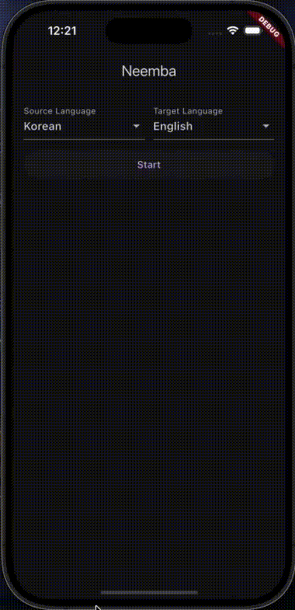
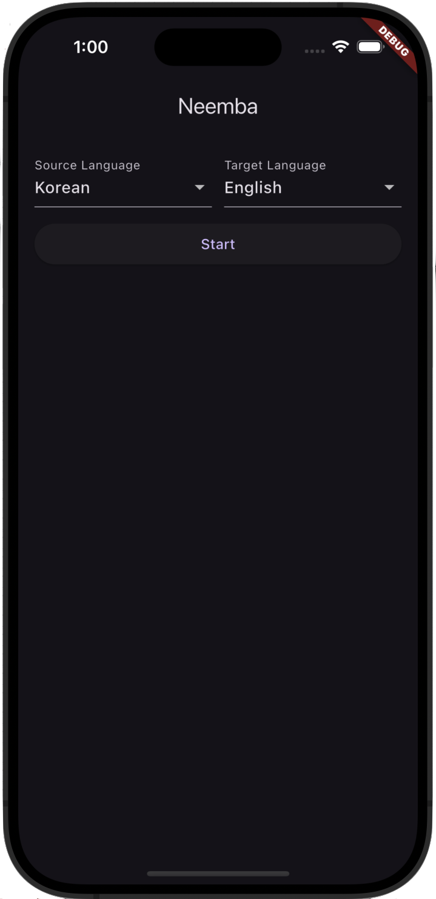
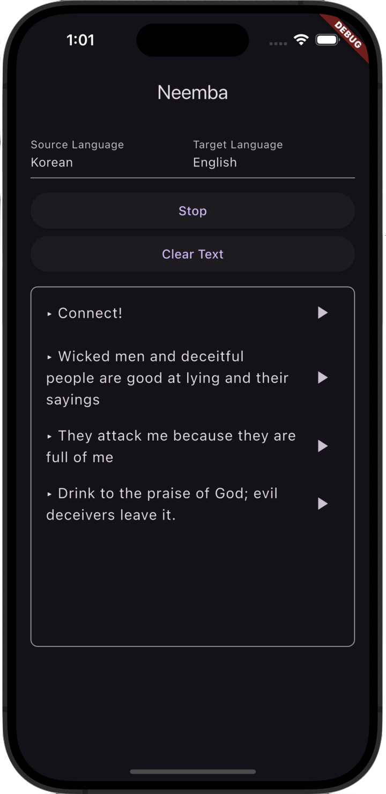

# Neemba
실시간 번역 어플리케이션입니다

## 개요
외국인 분들을 위한 장시간 실시간 번역 시스템

## 기술 스택
- Frontend : Flutter
- Backend: NodeJS(Express), Python(FastAPI)

## 레포지토리
- Frontend : https://github.com/pro047/Neemba_Front
- Backend : https://github.com/pro047/Neemba_Back

## 스크린샷
- translating

- start page

- translation page

  
